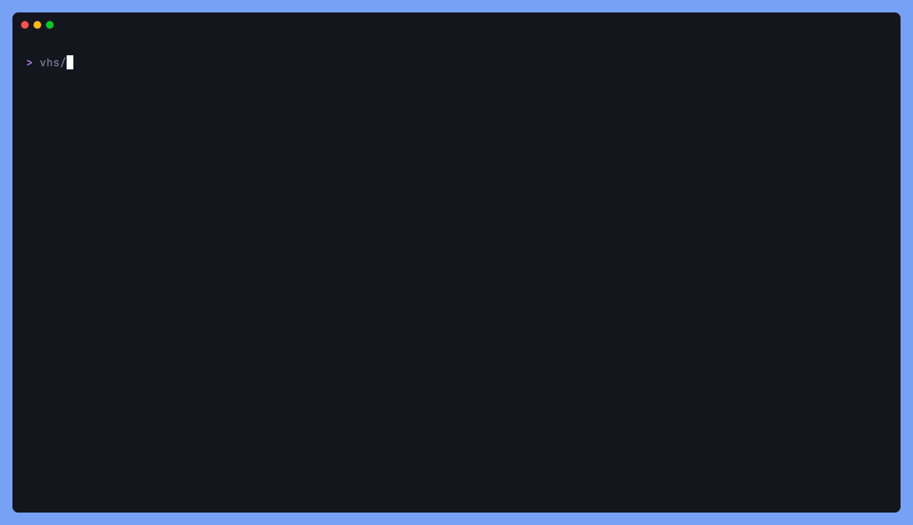
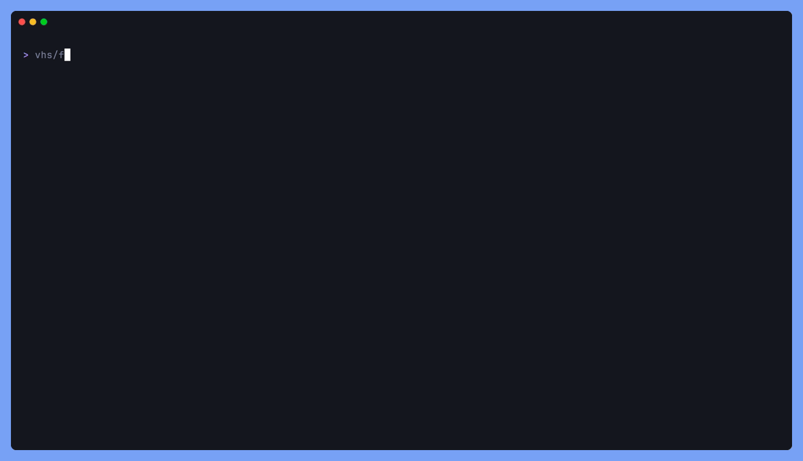
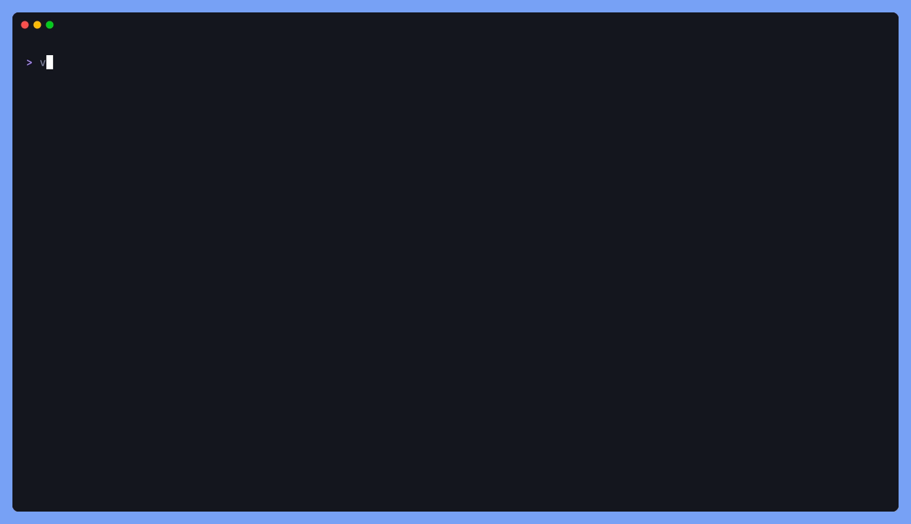

<div align="center">
  <h1>streamd</h1>
  <p>A CLI tool that renders streamed LLM output as beautiful markdown in the terminal.</p>

  <a href="https://github.com/Gaurav-Gosain/streamd/releases"></a>
  <a href="https://pkg.go.dev/github.com/Gaurav-Gosain/streamd?tab=doc"></a>
</div>

---

<p align="center">
  
</p>

streamd takes piped input from any LLM CLI or API endpoint and renders it as beautifully formatted markdown in the terminal. It auto-detects the input format and just works, whether you're piping from `curl`, `ollama run`, or plain text.

<details>
<summary>Table of Contents</summary>

- [Installation](#installation)
- [Usage](#usage)
- [Supported Formats](#supported-formats)
- [Features](#features)
- [Modes](#modes)
- [Thinking / Reasoning Support](#thinking--reasoning-support)
- [Usage Info](#usage-info)
- [Development](#development)
- [License](#license)

</details>

## Installation

### Package Managers

**Homebrew (macOS/Linux):**
```bash
brew tap Gaurav-Gosain/tap
brew install streamd
```

### Other Methods

- **[GitHub Releases](https://github.com/Gaurav-Gosain/streamd/releases)** - Download pre-built binaries
- **Go Install:** `go install github.com/Gaurav-Gosain/streamd@latest`
- **Build from Source:** See [Development](#development) below

**Requirements:**
- A terminal with true color support (most modern terminals work fine)
- Go 1.25+ (if building from source)

## Usage

> **Tip:** when piping from `curl`, use `-N` (`--no-buffer`) so each SSE
> event is flushed immediately. Without it curl batches output until
> its pipe buffer fills, which makes the stream look frozen.

```bash
# Ollama CLI, just pipe it
ollama run gemma3:4b "explain quicksort" | streamd

# Ollama native /api/chat
curl -sN http://localhost:11434/api/chat \
  -d '{"model":"gemma3:4b","messages":[{"role":"user","content":"hello"}],"stream":true}' | streamd

# Ollama /api/generate
curl -sN http://localhost:11434/api/generate \
  -d '{"model":"gemma3:4b","prompt":"explain quicksort","stream":true}' | streamd

# OpenAI-compatible endpoint
curl -sN https://api.example.com/v1/chat/completions \
  -H "Content-Type: application/json" \
  -d '{"model":"...","messages":[{"role":"user","content":"hello"}],"stream":true}' | streamd

# Any plain text or markdown
cat README.md | streamd
echo "# Hello **world**" | streamd

# Alt-screen mode with scrollable viewport
ollama run gemma3:4b "explain quicksort" | streamd --alt

# Show model info and token usage
curl -sN http://localhost:11434/api/chat \
  -d '{"model":"gemma3:4b","messages":[...],"stream":true}' | streamd --info

# Hide thinking/reasoning output
curl -sN ... | streamd --no-think

# Use a different glamour theme
curl -sN ... | streamd --style dracula
```

### Flags

| Flag | Short | Default | Description |
|------|-------|---------|-------------|
| `--alt` | | `false` | Interactive alt-screen with viewport scrolling |
| `--no-think` | | `false` | Hide thinking/reasoning output |
| `--info` | `-i` | `false` | Show model name, token usage, and speed after response |
| `--style` | | `dark` | Glamour style: `dark`, `light`, `dracula`, `tokyo-night`, `pink`, `ascii` |
| `--wrap` | `-w` | `0` | Word wrap width (0 = terminal width) |

The style can also be set via the `GLAMOUR_STYLE` environment variable.

## Supported Formats

streamd auto-detects the input format — no flags or configuration needed.

| Format | Source | Example |
|--------|--------|---------|
| **Plain text / Markdown** | `ollama run`, `cat`, `echo`, any CLI | `ollama run gemma3 "hi" \| streamd` |
| **Ollama `/api/chat`** | NDJSON streaming | `curl -s .../api/chat -d '...' \| streamd` |
| **Ollama `/api/generate`** | NDJSON streaming | `curl -s .../api/generate -d '...' \| streamd` |
| **OpenAI Chat Completions** | SSE streaming & non-streaming | `curl -s .../v1/chat/completions -d '...' \| streamd` |
| **OpenAI Responses API** | SSE with `response.output_text.delta` events | `curl -s .../v1/responses -d '...' \| streamd` |

## Features

- **Live markdown rendering** using [glamour](https://github.com/charmbracelet/glamour) v2 with syntax-highlighted code blocks, styled headings, lists, tables, and more
- **Universal input**: auto-detects SSE, NDJSON, and plain text so it works with any LLM tool
- **Event-driven rendering** with batched SSE reads for instant first-token display
- **Thinking/reasoning support** for models that expose chain-of-thought, via the `reasoning_content` SSE field or inline `<think>...</think>` tags
- **Clean scrollback**: inline mode streams in an alt-screen and prints the final output in one shot, so the result looks like a single command output
- **Interactive alt-screen mode** powered by [bubbletea](https://github.com/charmbracelet/bubbletea) with a scrollable viewport, scroll progress bar, and keyboard navigation
- **Usage info** (`--info`): model name, token counts, speed (tok/s), and duration on stderr
- **Multiple themes**: dark, light, dracula, tokyo-night, pink, ascii
- **Auto-detected terminal width** for proper word wrapping
- **Styled CLI help** via [fang](https://github.com/charmbracelet/fang)

## Modes

### Inline Mode (default)

<p align="center"></p>

The live view is rendered in an alt-screen so the terminal scrollback stays clean. When streaming finishes the alt-screen is dismissed and the final rendered output is printed in one shot, so the result reads as a single command output.

### Alt-Screen Mode (`--alt`)

<p align="center"></p>

Opens a full-screen interactive viewport with a scroll bar and status line. The stream auto-scrolls to follow new content; scrolling up pauses auto-scroll and `G` resumes it.

#### Keyboard Shortcuts

| Key | Action |
|-----|--------|
| `j` / `k` | Scroll down / up |
| `d` / `u` | Half-page down / up |
| `pgdn` / `pgup` | Page down / up |
| `g` / `G` | Go to top / bottom |
| `q` / `esc` / `ctrl+c` | Quit |

The viewport auto-scrolls to follow the stream. Scrolling up pauses auto-scroll; pressing `G` resumes it.

## Thinking / Reasoning Support

<p align="center"></p>

streamd supports models that expose their reasoning process. It handles two common patterns:

1. **`reasoning_content` field** (OpenAI-compatible). Reasoning tokens arrive in a separate `reasoning_content` field in the SSE delta, used by models like Qwen, DeepSeek, and others.

2. **`<think>` tags**. Some models wrap their reasoning in `<think>...</think>` tags within the regular `content` field.

Both patterns are detected automatically. Thinking content is rendered as an italic header followed by a blockquote, separated from the main response by a horizontal rule.

Use `--no-think` to hide reasoning output entirely.

## Usage Info

<p align="center"></p>

Pass `--info` (or `-i`) and streamd will print the model name, prompt/completion token counts, and (for Ollama) eval speed once the response completes. The info line goes to stderr so it doesn't pollute piped output.

## Development

Contributions are welcome. Feel free to open issues or pull requests.

**Build from source:**
```bash
git clone https://github.com/Gaurav-Gosain/streamd.git
cd streamd
go build -o streamd .
./streamd --help
```

**Regenerate README GIFs:** the `vhs/` directory holds [VHS](https://github.com/charmbracelet/vhs) tape scripts and a Makefile that builds every GIF embedded above. See [`vhs/README.md`](vhs/README.md).

### Dependencies

streamd is built on the [Charm](https://charm.sh) ecosystem:

| Library | Purpose |
|---------|---------|
| [glamour v2](https://github.com/charmbracelet/glamour) | Markdown rendering |
| [bubbletea v2](https://github.com/charmbracelet/bubbletea) | TUI framework (alt-screen mode) |
| [bubbles v2](https://github.com/charmbracelet/bubbles) | Viewport component |
| [lipgloss v2](https://github.com/charmbracelet/lipgloss) | Terminal styling |
| [fang](https://github.com/charmbracelet/fang) | Styled CLI help |

## Star History

[](https://star-history.com/#Gaurav-Gosain/streamd&Date)

<p style="display:flex;flex-wrap:wrap;">


</p>

## License

This project is licensed under the MIT License. See the [LICENSE](LICENSE) file for details.
